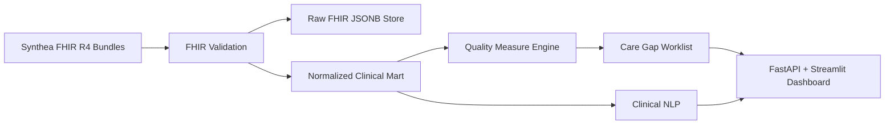

# ClinicalIQ Architecture

ClinicalIQ is a FHIR-native clinical analytics platform for synthetic patient data.

## Phase 0 Decisions

| Decision | Options | Recommendation |
|---|---|---|
| FHIR storage | Raw JSONB only, normalized only, both | Store both raw JSONB and normalized marts. Raw preserves provenance; marts make measures testable and SQL-friendly. |
| FHIR validation | Hand-rolled checks, `fhir.resources`, HAPI FHIR | Use `fhir.resources` in production path and lightweight Pydantic models in tests/MVP. |
| Dashboard | Streamlit, Next.js, Power BI | Streamlit first for clinical workflow speed; Next.js can be a later polish layer. |
| Synthea scope | 1k, 10k, 100k patients | Start with 10k Massachusetts patients for portfolio credibility without overloading local development. |

## HIPAA Mindset

The current project uses synthetic data only. Production deployment would require encryption in transit,
encryption at rest, role-based access control, audit logging, PHI-safe logs, key rotation, BAA coverage
with hosting vendors, and minimum-necessary data access.

